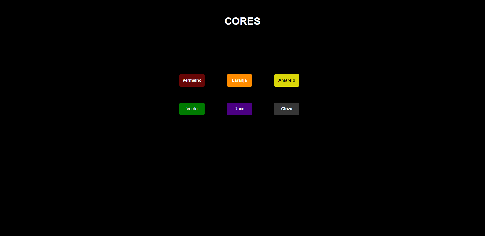

# Projeto das Cores

## 📷 Imagem do projeto

🔗 [Acesse](https://prdsilva80.github.io/cores/)

## 🛠️ Tecnologias

  

## 👨‍🎓 O que aprendi

- Embora simples, esse projeto me ajudou a ter mais lógica
- Usar a nomenclatura das cores atraves deste [site](https://www.homehost.com.br/blog/tutoriais/tabela-de-cores-html/)
- Entender melhor o JavaScript 

## 📧 Contato

<a href = "mailto:probertos717@gmail.com">
